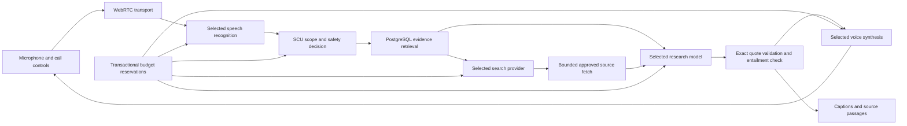

# Architecture and engineering decisions

The MVP is a Python 3.12/FastAPI service with a small browser call surface, Pipecat/aiortc WebRTC audio transport and PostgreSQL. The browser is a call client, not a separate information website. A future telephone adapter can feed the same speech/research pipeline; no telephone number or paid carrier is configured today.

## Provider contracts

`JsonModel.generate` must return a validated Pydantic object. The implementation has OpenAI, Gemini and Anthropic HTTP adapters. `SearchProvider.search` returns candidate URLs, not trusted facts. OpenAI and Tavily searches share the same independent fetch policy. Speech providers use Pipecat adapters. Credentials and model IDs are chosen by the server, while the developer UI selects among configured providers per role.

The research orchestrator contains no provider-specific network calls. The registry creates providers from the selected configuration. Provider availability means locally configured, not successfully authenticated or live verified. No automatic provider failover or hidden retries occur. OpenAI SDK speech retries are disabled through a narrowly contained compatibility adapter for the pinned Pipecat version. Other SDK retry/reconnect behavior remains bounded by call duration and reserved audio allowance; it still needs live account failure testing.

## Answer lifecycle

1. A validated question and up to three previous exchanges enter the scope classifier. School/term-sensitive questions should clarify; irrelevant, private, harmful and urgent decisions return fixed responses.
2. Full-text search finds at most four public cached documents. Their age is compared with source-specific TTLs. Date/time-sensitive queries refresh evidence before use.
3. With no adequate cached evidence, one search produces at most five candidate URLs; at most four unique approved URLs are fetched. Each fetch has an eight-second limit, two concurrent fetch slots, a two-megabyte response limit and at most four redirects. PDF extraction accepts at most ten pages.
4. The research model returns at most four findings, each with a known source ID and a contiguous quote. A cached draft that explicitly lacks evidence triggers one live search and one additional draft attempt. No recursive browsing or unbounded agent loop exists.
5. Deterministic validation rejects nonexistent IDs, invented quotations, uncited next steps, overlong speech and spoken URLs. A separate model pass checks applicability and entailment before the answer is released. Ordinary paths use three model calls; an insufficient cached draft can use four. The whole research turn has a 20-second default timeout.
6. Anonymous outcomes are recorded before a verified answer is sent to captions and TTS. An interrupted research task is canceled and generation checks reject obsolete results. History is cleared during call cleanup.

This is a bounded research agent, not an unrestricted browser automation system. A fetched page is not automatically complete: JavaScript calendars, PDFs over the extraction limit and information behind login can lead to an unavailable result. “Freshly fetched” means the public page was fetched recently; it does not prove the institution updated its underlying facts recently.

## Persistence

PostgreSQL provides a GIN full-text index, current source documents, changed-content versions, anonymous answer outcomes and helpfulness votes. The initial migration contains immutable DDL rather than importing mutable runtime models. New schema changes need new migrations. Each asynchronous transaction uses its own SQLAlchemy session.

Budget reservation inserts or locks a single budget row with `FOR UPDATE`. Reserving before an API request prevents concurrent requests from overspending the configured reservation cap. Reservations persist through restarts and failed/canceled requests. They are conservative usage allowances, not a billing reconciliation system. A fixed three-minute call reserves audio separately from model and search requests. The initial $8 cap is not automatically replenished monthly.

## Local networking and production boundaries

The server admits two calls per process and two simultaneous typed research requests. One process is deliberate for this MVP. PostgreSQL budget locking works across processes, but session ownership, close tokens, rate limiting and call admission are currently process-local. Multiple workers/replicas would need shared admission, session routing and global rate controls; do not enable them yet.

For loopback HTTP callers only, co-hosted browser mDNS candidates are expanded to this machine's local interfaces because macOS mDNS resolution can fail inside aiortc. This compatibility handling does not rewrite remote callers' SDP. STUN addresses are configurable; remote connectivity generally requires authenticated TURN and infrastructure appropriate for persistent audio sessions. A complete telephone adapter needs carrier signature verification, audio codec conversion and independent duration/cost enforcement.

Before a campus release, complete the deployment gate in SECURITY.md, verify real speech performance and guardrails, load-test cancellation and provider outages, choose production providers with measured costs, and obtain school review. Adding an API key is sufficient to expose an implemented adapter in the developer selector, not sufficient to certify it for production.

## Quantifiable pilot plan

Metrics implemented: answer outcomes, cache reuse, research p95 latency, provider token metadata, reserved allowance and optional helpfulness votes. Proposed pilot evidence: human-checked factual support and audience/year correctness on a fixed evaluation set; correct refusal/clarification on adversarial questions; task completion by consenting students/parents; time-to-answer compared with manually finding the same information; and actual provider invoice cost per completed session. These are measurement goals, not results already achieved. No claim of institution-wide impact is justified before a user study.
